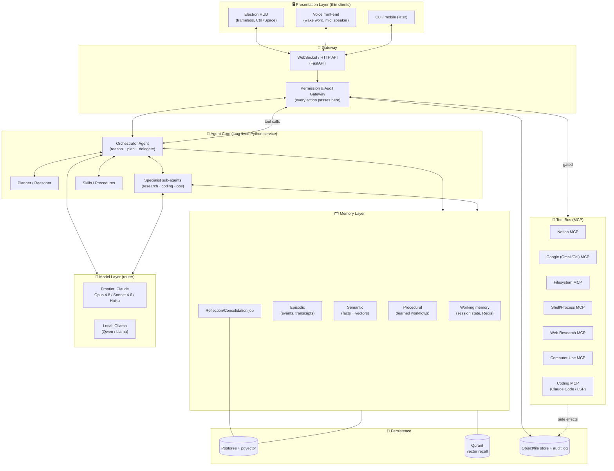
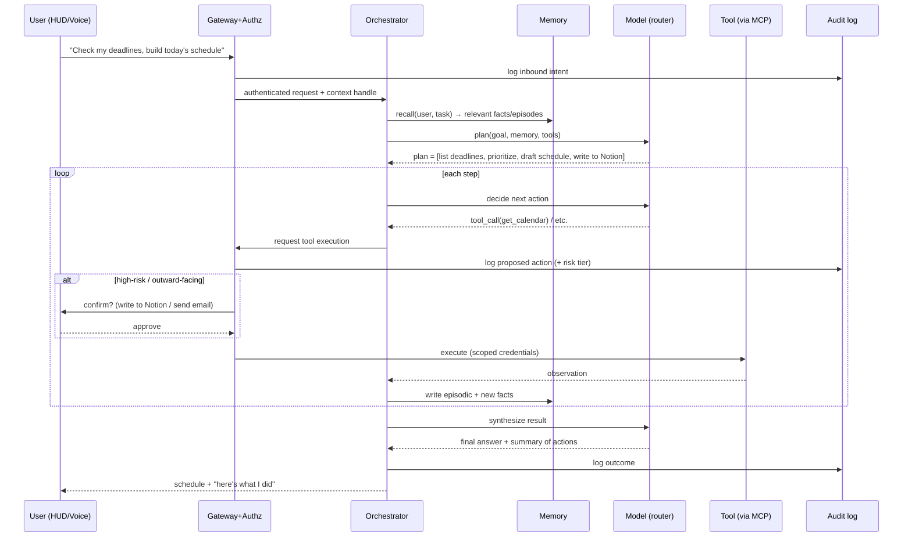
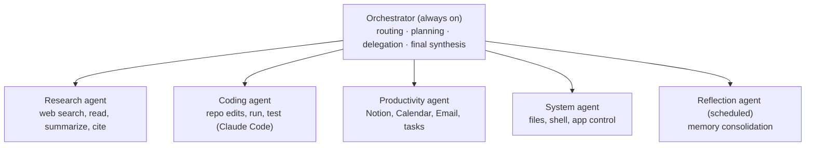
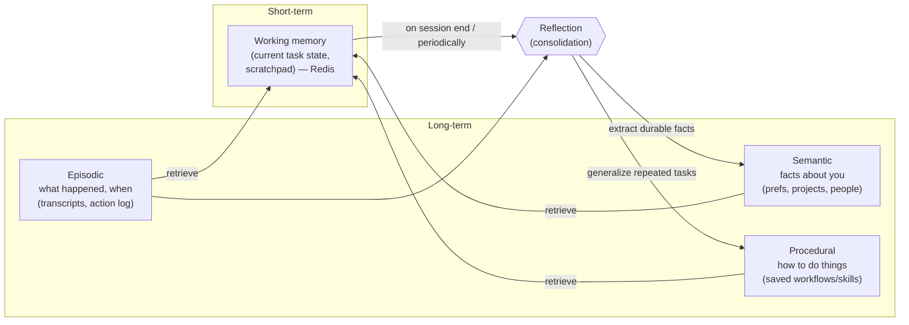
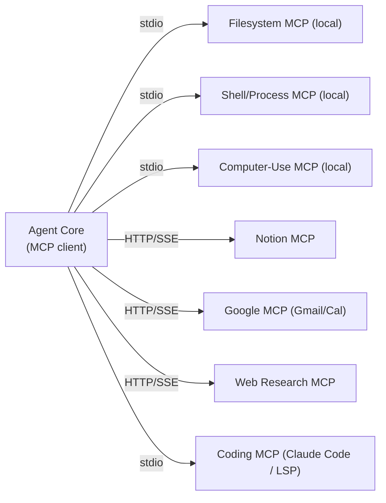
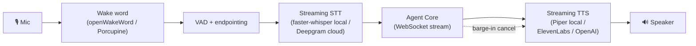
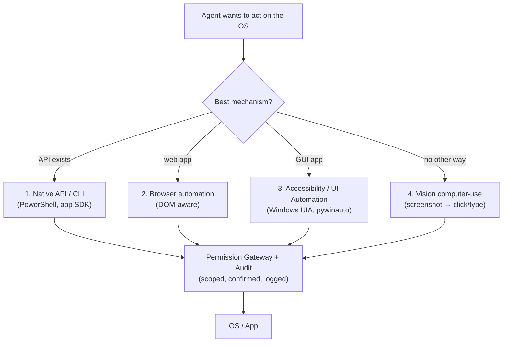
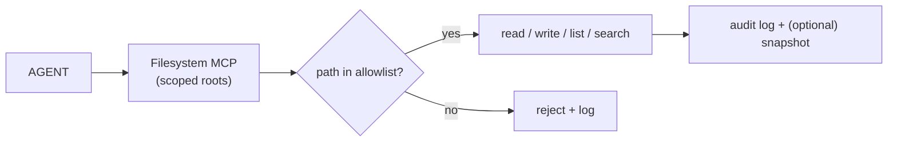
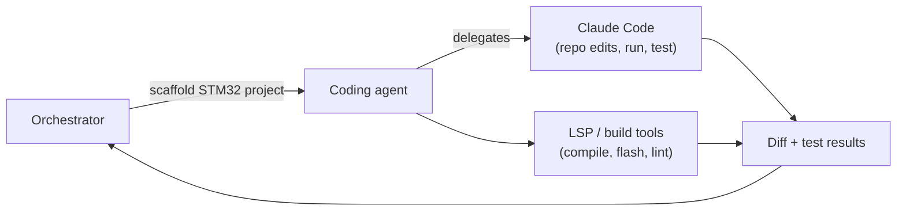
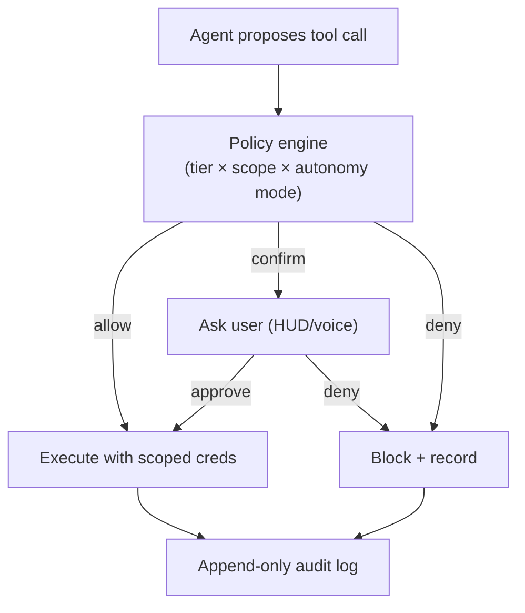

# J.A.R.V.I.S. — Personal AI Operating System
### Engineering Design Document
**Author:** Vipul · **Date:** 2026-06-13 · **Status:** Design v1 · **Target builder:** single developer, startup-grade architecture

---

## Reading guide

This is the architecture spec for a **personal AI operating system** — an autonomous agent platform that reasons, plans, remembers, uses tools, and takes action across your systems. It is *not* a chatbot.

It is written against what you have already started:

- **Electron HUD shell** (`jarvis-electron/`) — frameless, transparent, `Ctrl+Space` toggle. This is your **presentation layer**.
- Your stated wiring intent: **Ollama** (local LLM), **Qdrant** (vector memory), live telemetry.

The core architectural decision this document makes is: **keep the Electron HUD as a thin client, and put all reasoning/planning/memory/tools in a separate long-lived Python "Agent Core" service.** Everything else follows from that.

Sections 1–19 are the spec. Section 20 compares frameworks. Section 21 is the opinionated "what I would build today."

---

## 1. Vision and System Goals

### 1.1 Vision

> A persistent, trustworthy digital agent that knows my context, holds my long-term memory, and can safely act on my behalf across my computer, my cloud tools, and the web — turning intent ("plan my ML course", "continue my STM32 project") into completed, auditable work.

The mental model is an **operating system for intent**, not an app. Apps wait to be opened; an OS runs continuously, schedules work, manages resources (here: tools, memory, attention), and enforces permissions.

### 1.2 First-class goals

| # | Goal | What it means concretely |
|---|------|--------------------------|
| G1 | **Agency** | Executes multi-step tasks end-to-end, not just answers questions. |
| G2 | **Memory** | Remembers you across sessions — facts, preferences, projects, history. |
| G3 | **Context** | Understands the current situation: open files, calendar, recent work. |
| G4 | **Tool use** | Acts through real systems: Notion, Gmail, Calendar, filesystem, shell, web. |
| G5 | **Planning** | Decomposes vague goals into ordered, verifiable steps. |
| G6 | **Safety** | Never takes irreversible/outward-facing action without the right authority. |
| G7 | **Local-first / private** | Sensitive data and cheap tasks can run on-device (Ollama). |
| G8 | **Maintainable by one person** | No moving part exists without paying for itself. |

### 1.3 Explicit non-goals (v1)

- Not a multi-user SaaS. Single principal (you). This **simplifies auth, memory, and permissions enormously** — don't accidentally build for tenants you don't have.
- Not a general computer-use robot that does *anything* on screen. Computer control is scoped and gated (see §10, §15).
- Not model-training. You orchestrate frontier + local models; you don't train them.

### 1.4 Design principles

1. **Start with one agent and a tool loop. Add structure only when a measured failure demands it.** (This is the single most important principle — see §8.)
2. **Tools are the product.** The model is a commodity you can swap; your integrations and memory are the moat.
3. **Every action is typed, logged, and reversible-or-confirmed.**
4. **The agent core is a service, not a script.** It outlives any single window or conversation.
5. **Protocol over plumbing** — use **MCP** as the universal tool bus so integrations are reusable and decoupled.

---

## 2. Complete Architecture Diagram

### 2.1 Layered system view



### 2.2 Request lifecycle (a single user turn)



### 2.3 Process / deployment topology

- **Process 1 — Electron shell** (Node). UI only. No secrets, no model keys, no direct DB access.
- **Process 2 — Agent Core** (Python, FastAPI + agent runtime). Holds the brain, the router, the permission gateway.
- **Processes 3..N — MCP servers** (separate processes; some local, some remote/community). Sandboxed; least privilege.
- **Process W — Worker/Scheduler** (task queue) for long-running and scheduled autonomous jobs.
- **Datastores** — Postgres+pgvector, Qdrant, Redis, file/audit store.

Run it all with **Docker Compose** on one machine (your PC or a home server). This topology scales later by moving datastores/MCP servers to other hosts without redesign.

---

## 3. Agent Design

### 3.1 The "agent" is a loop, not a class

At core, every agent is the same loop:

```
observe → recall → think (LLM) → decide (tool call | finish) → act → observe → …
```

What differs between agents is: **system prompt + allowed tools + model + memory scope + stop condition.** Build this loop *once*, cleanly, and instantiate it with different configs. Do not write five different agent implementations.

### 3.2 Agent roster (hierarchical, on-demand)



- **Orchestrator** is the only always-resident agent. It owns the conversation, the plan, and the permission posture. It delegates *bounded* subtasks to specialists and integrates their results.
- **Specialists are spawned on demand** with a narrow toolset and a clear "return this artifact" contract. They are not chatty peers; they're functions that happen to be agentic.
- **Reflection agent** is not user-triggered; it runs on a schedule to consolidate memory (§5.5).

### 3.3 The agent contract (every agent declares)

| Field | Example | Why |
|-------|---------|-----|
| `name` / `role` | "research" | identity, logging |
| `model` | `claude-sonnet-4-6` | router can override |
| `system_prompt` | role + guardrails | behavior |
| `tools` | `[web.search, web.read, notion.create_page]` | capability boundary |
| `memory_scope` | read: semantic+episodic; write: episodic | least privilege on memory |
| `max_steps` / `budget` | 20 steps / $0.50 | runaway protection |
| `output_schema` | Pydantic model | typed, verifiable handoff |
| `permission_tier` | "propose" vs "auto" | safety posture |

This contract is the heart of maintainability: a new agent is a config object, reviewable at a glance.

### 3.4 Why typed outputs matter

Specialist → orchestrator handoffs should be **structured objects** (Pydantic), not free text. A research agent returns `ResearchReport(findings=[...], sources=[...], confidence=...)`, not a paragraph the orchestrator must re-parse. This is what makes multi-step pipelines reliable instead of a game of telephone.

---

## 4. Planning and Reasoning System

### 4.1 Three tiers of "thinking" — match effort to difficulty

| Tier | When | Mechanism | Cost |
|------|------|-----------|------|
| **Reactive** | single obvious action ("what's on my calendar today") | direct tool call, no plan | cheap (Haiku/Sonnet) |
| **Deliberate** | multi-step but linear ("study plan → Notion") | explicit plan, then execute loop | medium (Sonnet) |
| **Reflective** | ambiguous/long-horizon ("continue my STM32 project") | plan + sub-goals + re-plan on failure + verification | expensive (Opus + extended thinking) |

A cheap **router/classifier** (Haiku) tags each request with a tier so you don't burn Opus on "what time is it".

### 4.2 Planning pattern: Plan → Act → Observe → Re-plan

Use **explicit, inspectable plans** (a list of typed steps), not implicit chain-of-thought buried in tokens. A plan step:

```
Step(id, description, tool?, args?, depends_on=[...], status, result, verify=...)
```

Benefits for a solo dev: the plan is **renderable in the HUD** (the user sees what JARVIS intends *before* it acts — critical for trust and safety), **resumable** (persist it; survive a crash), and **debuggable** (you can see exactly which step failed).

### 4.3 Reasoning techniques, and when to use each

- **Decomposition (always):** turn a goal into sub-goals. The single highest-leverage technique.
- **ReAct (the default execution loop):** interleave reasoning + tool calls.
- **Extended thinking / scratchpad (hard reasoning steps):** let Opus think before committing to a risky plan.
- **Reflexion / self-critique (on failure):** when a step fails or verification fails, feed the failure back and re-plan — but cap retries (e.g., 2) to avoid loops.
- **Verification step (before "done"):** an explicit check — "does the Notion page exist? does the schedule cover all deadlines?" Cheap model, big reliability win.

### 4.4 Durability and human-in-the-loop

Long autonomous jobs ("research the latest video frame interpolation papers and build a page") must be:

- **Checkpointed** — plan + step results persisted after each step, so a crash/restart resumes mid-plan.
- **Interruptible** — user can pause/cancel from the HUD.
- **Gated** — the plan can include "await human approval" steps before irreversible actions.

This is exactly the capability LangGraph's checkpointer gives you for free; if you don't use LangGraph, you implement a small "plan store + resume" yourself (see §20/§21).

---

## 5. Memory Architecture

Memory is the difference between "a chatbot" and "JARVIS." Model it after human memory: four kinds, with a consolidation loop.



### 5.1 Working memory
Current goal, active plan, recent turns, tool results in flight. Lives in Redis + the live context window. Ephemeral, fast, scoped to a session/task.

### 5.2 Episodic memory
An append-only log: messages, decisions, **every tool call and its result**, outcomes. This is your audit trail *and* your "what did we do last Tuesday" recall. Stored in Postgres; large blobs/files in the object store. Summaries embedded for retrieval.

### 5.3 Semantic memory (the "knowledge of you")
Durable facts: preferences ("I use STM32CubeIDE", "I prefer concise summaries"), entities (courses, projects, people), relationships. **Hybrid store:**
- **Structured** rows in Postgres for things you query exactly (projects, deadlines, contacts).
- **Vector** embeddings in **Qdrant** (your choice — good) or `pgvector` for fuzzy semantic recall ("things related to my ML course").
- Optional **graph** edges (entity↔entity) — start with a `relations` table in Postgres; only graduate to a real graph DB if queries demand it.

### 5.4 Procedural memory
Learned, reusable workflows ("how I like a research page structured", "my project-scaffold steps"). Stored as parameterized **skills** (see §6.4). This is how JARVIS gets *better at being your* assistant over time.

### 5.5 The reflection / consolidation loop (the secret sauce)
A scheduled job (the Reflection agent) periodically:
1. Reads recent episodic memory.
2. Extracts durable facts → writes/updates semantic memory (dedup against existing).
3. Notices repeated task patterns → proposes new procedural skills.
4. Summarizes and compresses old episodes to keep recall cheap.

Without consolidation, long-term memory becomes an undifferentiated log you can't use. With it, JARVIS forms a stable model of you.

### 5.6 Retrieval strategy
On each turn: **(a)** pull structured facts relevant to named entities, **(b)** vector-search semantic+episodic for the current query, **(c)** rank + dedup + budget into the context window. Always cite memory provenance internally so you can debug "why did it think that?"

### 5.7 Build vs. buy
You can hand-roll this on Postgres+Qdrant (full control, more work), or bootstrap with a memory framework — **Letta (formerly MemGPT)**, **Mem0**, or **Zep** — and migrate later. Recommendation: **start with your own thin memory manager over Postgres+Qdrant** (you already chose Qdrant), because memory is your moat and you want to own its semantics. Evaluate Mem0/Letta only if consolidation becomes a time sink.

---

## 6. Tool Architecture

### 6.1 The tool is the unit of capability

Everything JARVIS can *do* is a tool. A tool has:

```
Tool(
  name, description (LLM-facing),
  input_schema (Pydantic), output_schema,
  risk_tier ∈ {read, write, irreversible, outward, spend},
  scopes (which credentials/paths it may touch),
  handler (the actual call)
)
```

### 6.2 Risk tiers drive permissions (this is the linchpin)

| Tier | Examples | Default posture |
|------|----------|-----------------|
| `read` | list files, read calendar, web search | auto |
| `write` | create Notion page, write local file in project dir | auto in allowed scope, else confirm |
| `irreversible` | delete file, overwrite, drop data | always confirm |
| `outward` | send email, post, message a person | always confirm (it leaves your control) |
| `spend` | anything costing money / placing orders | always confirm + hard caps |

The model never decides its own permission tier — the **tool's static tier** plus the **gateway** (§15) decides. This separation is what makes autonomy safe.

### 6.3 Tool grouping (by domain → maps to MCP servers)

`web.*`, `notion.*`, `google.*` (gmail/calendar), `fs.*`, `proc.*` (shell/scripts), `computer.*` (UI control), `code.*` (repo ops), `memory.*`, `schedule.*`.

### 6.4 Skills = composed tools + procedure
A **skill** is a higher-order, reusable procedure built from tools (e.g., `create_research_page(topic)` = web.search → web.read×N → summarize → notion.create_page → notion.append). Skills are how procedural memory becomes executable. Keep them declarative and parameterized.

### 6.5 Tool design rules
- **Descriptions are prompts.** Write tool descriptions for the model, with examples and failure modes.
- **Idempotency where possible.** Re-running shouldn't double-create.
- **Return structured observations**, including errors as data (not exceptions the loop can't see).
- **Small, composable tools beat one mega-tool.** `notion.create_page` + `notion.append_block` > `notion.do_everything`.

---

## 7. MCP Integration Strategy

**Model Context Protocol is the backbone of this design.** It's the open standard (2024→) for exposing tools/resources/prompts to agents over a uniform interface. For a solo dev, MCP is the single biggest force multiplier: you get a growing ecosystem of pre-built integrations and a clean boundary between "the brain" and "the hands."

### 7.1 Why MCP here
- **Decoupling:** the agent core depends on the *protocol*, not on the Notion SDK, the Google SDK, etc. Swap/upgrade integrations without touching the brain.
- **Reuse:** consume community/official MCP servers (filesystem, GitHub, Notion, web, Slack…) instead of writing them.
- **Isolation/security:** each MCP server is a separate process you can sandbox and grant least privilege.
- **Portability:** the same MCP servers work with Claude Desktop, Claude Code, and your custom core.

### 7.2 Topology



- **Local, high-trust, low-latency** tools (filesystem, shell, computer-use) → **stdio** transport, run as child processes on your machine.
- **Remote/credentialed** tools (Notion, Google) → **HTTP/SSE** MCP servers; secrets live in the server, not the prompt.

### 7.3 Strategy / rollout
1. **Consume first, build second.** Use official Notion, Google, GitHub, filesystem MCP servers where they exist and are trustworthy.
2. **Write custom MCP servers** only for your bespoke needs (e.g., your STM32 project tracker, your telemetry).
3. **Wrap everything behind your permission gateway** — MCP gives you the *capability*; your gateway decides *whether and when* to use it (§15). Do **not** let the model talk to MCP servers without passing through your authz/audit layer.
4. **Registry + health checks** — the core keeps a registry of connected servers, their tools, schemas, and a heartbeat; degrade gracefully when one is down.

### 7.4 Caution
MCP is powerful but you are responsible for trust. Vet third-party servers (they run with whatever creds you give them). Pin versions. Treat tool descriptions from untrusted servers as potential prompt-injection vectors (§15.6).

> **UPDATE — 2026-06-16: the MCP bus landed.** `core/mcp/` now implements the design's backbone (it had been deferred while the build went wide on agents/voice/memory). The Agent Core is an **MCP client**: `client.py` (the `MCPManager` — a dedicated background asyncio loop where each server owns its own task, so the sync orchestrator can use long-lived stdio sessions) connects to servers declared in `servers.yaml`, discovers their tools, and builds a flat registry. The official **filesystem server** (npx, stdio) ships enabled, **scoped to the workspace sandbox** — which simultaneously satisfies the §13.1 "allowlisted roots" rule. Crucially, every tool call flows through the **Permission & Audit Gateway (§15)** with a *per-tool* risk tier (`classify_tool` → read/write/irreversible/outward), which is the §6.2/§14.3 **per-call granularity** MCP was supposed to unlock — the gateway now gates the *tool*, not just the whole agent. A generic `agents/mcp_agent.py` (single agent, MCP tools — the §8 pattern) selects + runs one tool per turn; the orchestrator gained an `mcp` domain and `/api/mcp{,/tools,/call}` endpoints (the raw call endpoint is gated too). Verified: `scripts/test_mcp.py` 37/37 — tier mapping, config/`${VAR}` expansion, result normalization, graceful degradation, orchestrator wiring, and a **live filesystem connect + gateway-gated write/read** in the sandbox. **Honest scope / next:** (1) **stdio transport only** — remote **HTTP/SSE** servers (Notion, Google) are the documented seam in `servers.yaml` but not wired yet; (2) the read-only `files` agent is **not yet migrated** onto the filesystem server (kept as fallback); (3) consuming official Notion/Google/git servers replaces the hand-rolled agents incrementally (§7.3 "consume first"); (4) the LLM tool-selection + router→`mcp` link depends on local Ollama quality (a frontier router is the lever, §16).

---

## 8. Multi-Agent vs Single-Agent Analysis

This is the decision that most often sinks solo-dev agent projects. **Be conservative.**

### 8.1 The honest trade-off

| | Single agent + tools | Multi-agent (swarm) | Hierarchical (orchestrator + on-demand specialists) |
|---|---|---|---|
| Reliability | High (one context) | Low (coordination failures compound) | Medium-High |
| Debuggability | High | Low (which agent broke?) | Medium |
| Token cost | Low | High (agents re-explain to each other) | Medium |
| Parallelism | Limited | High | High where it matters |
| Solo-dev maintainability | **Best** | **Worst** | Good |
| Right for | 80% of tasks | research fan-out, true parallel work | this project |

### 8.2 The trap
Multi-agent demos look impressive and *feel* like "real architecture." In practice, free-form multi-agent systems fail at **coordination**: agents lose shared context, disagree, loop, and 3× your token bill while being *harder* to debug. A single well-equipped agent beats a committee of confused ones.

### 8.3 The rule for this project
> **Start single-agent. Escalate to a sub-agent only when a task is (a) clearly separable, (b) benefits from a different toolset or a fresh/again-large context window, or (c) genuinely parallelizable.**

Good reasons to spawn a sub-agent:
- **Context isolation:** a big research dive shouldn't pollute the orchestrator's context — fan it out to a research sub-agent that returns a compact report.
- **Parallel fan-out:** read 8 papers concurrently, each in its own short-lived agent.
- **Distinct capability boundary:** the coding agent needs repo tools + a different prompt and shouldn't have your email-send tool.

**Verdict: hierarchical orchestrator with on-demand, single-purpose specialists. No peer-to-peer swarm, no agents debating.** This is the SOTA-pragmatic 2026 pattern and the only one a single developer can keep alive.

---

## 9. Voice Interface Design

The "JARVIS feel" is mostly latency and turn-taking. Architect for streaming from day one.



### 9.1 Pipeline choices
- **Wake word:** `openWakeWord` (open, local, free) or Porcupine (polished). Local, always-on, tiny.
- **STT:** **`faster-whisper`** locally (privacy, no per-minute cost) for most use; pluggable cloud (Deepgram/AssemblyAI) when you want lowest latency. Stream partials.
- **TTS:** **Piper** locally for cheap/private; **ElevenLabs/OpenAI** for a premium voice. Stream audio out so speech starts before the full reply is generated.
- **Turn-taking:** VAD-based endpointing + **barge-in** (user interrupts → cancel TTS immediately). This single feature is what makes it feel alive.

### 9.2 Latency budget (target < 1.2 s to first audio)
wake (instant) → endpoint (~200 ms after speech stops) → STT partial→final (~150–300 ms) → first model tokens (~300–500 ms) → first TTS audio (~150 ms). Hit it by **streaming every stage** and starting TTS on the first sentence.

### 9.3 Realtime option
For the lowest-latency, most natural feel, a **speech-to-speech realtime model** (e.g., OpenAI Realtime / Gemini Live class) collapses STT+LLM+TTS. Trade-off: less control over tool-calling/memory and harder to keep local/private. **Recommendation:** build the modular pipeline first (full control, swappable, local-capable); offer realtime as an alternate "fast voice" mode later.

### 9.4 Integration with HUD
Voice and the Electron HUD share one backend session over WebSocket. The HUD visualizes state (listening / thinking / acting / speaking) — the classic JARVIS waveform/arc reactor — driven by backend events.

---

## 10. Computer Control Architecture

The highest-power, highest-risk capability. Treat it like handing JARVIS your keyboard. Layer it by trust and reliability.



### 10.1 Prefer the highest tier available (most reliable, least risky)
1. **Native API / CLI / PowerShell** — *always* first choice. "Open VS Code, create a folder, generate files" = filesystem tool + `code` CLI, **not** clicking pixels. Deterministic and safe.
2. **DOM-aware browser automation** (Playwright/Chrome MCP) for web apps — robust, inspectable.
3. **OS accessibility / UI Automation** — on Windows, **UI Automation (UIA)** + `pywinauto` to drive native apps via the accessibility tree (find a button by name, not coordinates). Far more reliable than pixels.
4. **Vision-based computer-use** (Claude computer-use style: screenshot → reason → click/type) — the **last resort** for apps with no API and no accessibility surface.

### 10.2 Windows specifics
- **PowerShell** for system tasks, app launching, process/file ops.
- **`pywinauto` / UIA** for native GUI control.
- **Playwright** for browsers.
- A **sandbox/VM** for anything untrusted; never let computer-use run unattended on irreversible actions.

### 10.3 Safety rails (non-negotiable)
- Computer-use tools are **`irreversible`/`outward` tier by default** → confirmation gated.
- **Scoped to allowlisted apps/paths.** JARVIS can scaffold under `~/Documents/projects`, not roam your whole disk.
- **Dry-run + preview:** show the planned action in the HUD before executing.
- **Kill switch:** global hotkey halts all computer-use immediately.
- **Never auto-click links** from email/messages; resolve and confirm URLs (§15.6).

---

## 11. Web Research Architecture

Turns "find the latest papers on video frame interpolation, summarize, make a page" into a reliable pipeline.


### 11.1 Components
- **Search layer:** a general API (**Tavily** is purpose-built for agents; Brave/SerpAPI also fine) **plus domain sources** for academic work (**arXiv API, Semantic Scholar, OpenAlex**). For papers, hit the scholarly APIs directly — better metadata and recency than web search.
- **Fetch/extract:** readability extraction for HTML, a PDF parser for papers. Cache aggressively (don't re-fetch).
- **Rank/dedup:** score by relevance + recency + source authority; collapse duplicates.
- **Parallel deep-read:** fan out one short-lived sub-agent per source (this is a *justified* multi-agent case, §8) → each returns a compact, cited summary.
- **Synthesis + verification:** combine into a structured report; a verification pass checks each claim is supported by a cited source (anti-hallucination).
- **Output:** typed `ResearchReport` → rendered into Notion (§12).

### 11.2 Principles
- **Citations are mandatory.** Every claim carries a source URL/DOI. No source → flag as low-confidence.
- **Budget the crawl** (max sources, max depth) — research agents love to wander.
- **Prefer primary sources** for academic topics.

---

## 12. Notion Integration Strategy

Notion is your structured knowledge surface (notes, trackers, study plans, research pages).

### 12.1 Access
Use the **official Notion MCP server** (or the Notion API behind a thin custom MCP if you need bespoke shaping). Auth via an internal integration token, **stored in the MCP server / vault — never in the prompt.**

### 12.2 Model your workspace as typed databases, not loose pages
Define a small schema JARVIS understands and writes to consistently:

| DB | Key properties | JARVIS uses it for |
|----|----------------|--------------------|
| **Projects** | name, status, area (academic/eng/research), links | "continue my STM32 project" |
| **Tasks** | title, project→relation, due, priority, status | deadlines, today's schedule |
| **Notes** | title, project→relation, tags, body | course notes, STM32 notes |
| **Research** | topic, papers (sub-items), summary, sources | research pages |
| **Study Plans** | course, week, objectives, resources | "ML study plan" |

### 12.3 Capabilities
- **Read:** query databases (deadlines, project notes) → feeds planning/memory.
- **Write:** create/append pages with proper block structure (headings, toggles, callouts, tables). Build **templated skills** (`create_study_plan`, `create_research_page`) so output is consistent and good-looking.
- **Sync:** Notion is a **system of record** that mirrors into semantic memory — but treat Notion as source of truth for things you also edit by hand; reconcile on read.

### 12.4 Safety
Page creation/append = `write`; deleting/overwriting existing pages = `irreversible` → confirm. Scope the integration to a specific JARVIS workspace/teamspace so it can't touch unrelated content.

---

## 13. Local File System Integration



### 13.1 Principles
- **Allowlisted roots only.** Define explicit roots (e.g., `Documents/projects`, `Documents/ME AI`, a research dir). Everything else is invisible to JARVIS. This one rule prevents the scariest failure modes.
- **Tiered ops:** read/list/search = `read` (auto). Create/write in-scope = `write`. **Delete/overwrite = `irreversible`** → confirm + ideally snapshot-before (copy to a `.jarvis-trash`).
- **Indexing for retrieval:** maintain a local index (file metadata + embeddings of text/code) so JARVIS can "find my STM32 notes" semantically. Re-index on change (watcher).
- **Respect ignores:** honor `.gitignore`-style rules; never index secrets/`.env`.

### 13.2 Mechanism
Use the official **filesystem MCP server** with configured roots, fronted by your gateway. For code-aware ops, pair with the coding layer (§14).

---

## 14. Coding Assistant Integration

You want JARVIS to *do* engineering work (STM32, project scaffolding, etc.). **Don't reinvent a coding agent — wrap a great one.**

### 14.1 Strategy: delegate to Claude Code as a sub-agent
The **Claude Agent SDK / Claude Code** is a production-grade coding agent (repo understanding, edits, run, test, lint). The Coding agent in your roster (§3.2) should **invoke Claude Code** (via its SDK or as an MCP-exposed capability) for actual code work, rather than you hand-building file-editing loops.



### 14.2 Capabilities
- **Scaffold:** "create a project folder + starter files" → filesystem + `code` CLI + Claude Code generation.
- **Continue dev:** read repo + your notes (memory + Notion) → propose and apply diffs → run/test.
- **Embedded-specific:** wrap your toolchain (arm-none-eabi-gcc, CubeMX configs, flashing) as tools so JARVIS can build/flash, not just write text.
- **Review loop:** generate → run tests → read failures → fix (Reflexion, capped).

### 14.3 Safety
Code execution runs in a **scoped working dir**; destructive git ops (`reset --hard`, force-push) are `irreversible`→confirm; never commit/push or touch secrets without explicit approval.

> **TODO (gateway integration) — added 2026-06-14.** A first coding agent exists (`core/agents/coder.py`: generate / edit / read / run). Its safety today is *interim*: writes/edits/runs are sandboxed to `workspace/` (`_safe_path` rejects escapes), execution is gated by explicit intent (`run_after`) + an env kill switch (`JARVIS_CODER_NO_RUN=1`), with a 30s timeout — but it does **not yet pass through the Permission & Audit Gateway (§15.1)**. When the gateway lands (Phase 5), route `code.write` and `code.run` through it as `irreversible`-tier actions (confirm-by-default, audit-logged), and replace the env kill switch with the gateway's autonomy modes (§15.2). Until then, the sandbox + intent gate are the only guardrails.
>
> **UPDATE — 2026-06-15: gateway landed (early).** `core/security/` now implements the Permission & Audit Gateway (`gateway.guard` chokepoint, `policy` engine over `tiers`, append-only `audit` log) and the orchestrator routes **every** agent dispatch through it. The coder is classified per-command: plain write → `write` (auto in copilot, sandboxed + audited); **write-and-run → `irreversible` → confirm-by-default** with approve/deny + autonomy modes replacing the bare env kill switch. Remaining gap: gating is at **dispatch granularity** (one decision per agent call), not per-tool — precise per-call tiers arrive with the single tool-emitting agent loop (§3.1). The interim sandbox/timeout still apply underneath.

---

## 15. Security and Permission Design

For an agent that reads your email, controls your computer, and spends potentially real effort/money, **this section is the product**, not an afterthought.

### 15.1 The Permission & Audit Gateway (single chokepoint)
**Every tool call passes through one gateway.** The model proposes; the gateway disposes.



### 15.2 Tiered autonomy modes
A global posture you set (and JARVIS can be told per-task):

| Mode | Behavior |
|------|----------|
| **Observe** | reads only; proposes actions but executes nothing |
| **Co-pilot** (default) | auto for `read`/in-scope `write`; confirm `irreversible`/`outward`/`spend` |
| **Autopilot (bounded)** | auto within an explicit budget + allowlist for a defined task; still hard-stops on `outward`/`spend` |

### 15.3 Capability scoping & least privilege
- Each MCP server / tool gets **only** the credentials and paths it needs.
- Secrets in a **vault** (OS keychain / `keyring` / SOPS / Vault) — **never in prompts, code, or the Electron renderer.**
- Per-tool **scopes** (Notion: one workspace; filesystem: specific roots; Google: specific scopes).

### 15.4 Audit & reversibility
- **Append-only audit log** of every proposed/approved/executed/denied action with inputs, outputs, and which model/agent decided. This is also episodic memory.
- **Reversibility:** snapshot before destructive file ops; soft-delete; keep a "what JARVIS did" timeline in the HUD with undo where feasible.
- **Hard caps:** step/time/$ budgets per task; global kill switch.

### 15.5 Fix your current Electron security posture (concrete, do this early)
Your `jarvis-electron/main.js` uses `nodeIntegration: true` and `contextIsolation: false`. For an app wired to an AI that can touch the filesystem/shell, **that is unsafe** — any injected/remote content in the renderer would get full Node/OS access. Change to:
- `contextIsolation: true`, `nodeIntegration: false`, `sandbox: true`.
- Expose a **minimal, explicit API** from a **preload script** via `contextBridge` (e.g., only `jarvis.send(msg)`, `jarvis.onState(cb)`, window controls).
- The renderer talks to the **Agent Core over WebSocket**, not to Node/OS directly.
- Add a strict **Content-Security-Policy**; never load remote/untrusted HTML into the HUD.

### 15.6 Prompt-injection & untrusted-content defense
Email bodies, web pages, file contents, and third-party MCP tool descriptions are **untrusted input that may try to hijack the agent**. Mitigations:
- Treat retrieved content as **data, not instructions**; the orchestrator's system prompt asserts this.
- **Outward/irreversible actions always require human confirmation** regardless of what content "asks" — injection can't escalate past the gateway.
- **Never auto-follow links** from messages; surface the full URL for confirmation.
- Sandbox/limit what fetched content can trigger.

### 15.7 Privacy
Route sensitive data (personal notes, email contents) to **local models (Ollama)** when feasible; only send to frontier APIs what the task needs. Make the local/cloud routing **visible and configurable**.

---

## 16. Technology Stack Recommendations

Opinionated, solo-dev-optimized, 2026.

| Layer | Recommendation | Why / alternatives |
|-------|----------------|--------------------|
| **Agent core language** | **Python 3.12+** | Best agent/ML ecosystem, MCP SDKs, async. |
| **Agent framework** | **PydanticAI** (primary) + **LangGraph** for durable autonomous workflows (Phase 6) | Typed, low-magic, model-agnostic, testable. See §20. |
| **Tool protocol** | **MCP** everywhere | Decoupled, reusable, sandboxable. |
| **Models (frontier)** | **Claude — Opus 4.8** (hard planning/reasoning), **Sonnet 4.6** (default tool loop), **Haiku 4.5** (routing/classification) | Strong agentic tool use + extended thinking; route by tier (§4.1). |
| **Models (local)** | **Ollama** running **Qwen / Llama** class | Privacy, offline, cheap tasks (your existing choice — keep it). |
| **API / gateway** | **FastAPI** + WebSocket | Streaming, async, typed (Pydantic synergy). |
| **Task queue / scheduler** | **Celery or RQ** + Redis (or **Temporal** if you want serious durability) | Long-running + scheduled autonomous jobs. |
| **Relational DB** | **Postgres 16 + pgvector** | Spine for entities/tasks/audit + can also do vectors. |
| **Vector DB** | **Qdrant** | Your choice — great for semantic recall at scale; pgvector if you want one fewer service. |
| **Cache / hot state / broker** | **Redis** | Working memory, queues, pub/sub for HUD events. |
| **Voice** | `openWakeWord` + `faster-whisper` (STT) + Piper/ElevenLabs (TTS) | Local-first, swappable (§9). |
| **Desktop shell** | **Electron** (you have it) — hardened per §15.5 | HUD; thin client to the core. |
| **Browser automation** | **Playwright** / Chrome MCP | DOM-aware web control. |
| **Native control (Win)** | **PowerShell**, **pywinauto/UIA**, computer-use as last resort | §10. |
| **Coding** | **Claude Code / Agent SDK** wrapped as the coding sub-agent | §14. |
| **Observability** | **OpenTelemetry** + **Langfuse** (LLM traces) | See what the agent did, debug loops, track cost. |
| **Secrets** | OS keyring / **SOPS** / Vault | §15.3. |
| **Packaging** | **Docker Compose** | One-command local stack; scale later. |

---

## 17. Detailed Folder Structure

A monorepo. `jarvis-electron/` (yours) stays as the client; everything below is the new core.

```
ME AI/
├─ jarvis-electron/                 # EXISTING — presentation layer (thin client)
│  ├─ main.js                       #   hardened per §15.5 (contextIsolation, preload)
│  ├─ preload.js                    #   NEW — contextBridge: minimal jarvis API
│  └─ renderer/                     #   HUD UI; talks to core over WebSocket
│
├─ core/                            # Agent Core (Python service) — the brain
│  ├─ app/
│  │  ├─ main.py                    #   FastAPI app, WebSocket endpoints
│  │  ├─ config.py                  #   settings (pydantic-settings)
│  │  └─ events.py                  #   HUD state events (listening/thinking/acting)
│  ├─ agents/
│  │  ├─ base.py                    #   the ONE agent loop (§3.1)
│  │  ├─ orchestrator.py
│  │  ├─ research.py
│  │  ├─ coding.py
│  │  ├─ productivity.py
│  │  ├─ system.py
│  │  └─ reflection.py
│  ├─ planning/
│  │  ├─ planner.py                 #   decompose → typed Plan/Step
│  │  ├─ plan_store.py              #   persist/resume (checkpointing)
│  │  └─ router.py                  #   reactive/deliberate/reflective tiering
│  ├─ memory/
│  │  ├─ manager.py                 #   recall + write orchestration
│  │  ├─ working.py                 #   Redis-backed session state
│  │  ├─ episodic.py
│  │  ├─ semantic.py                #   structured + vector
│  │  ├─ procedural.py              #   skills store
│  │  └─ consolidation.py           #   reflection job logic
│  ├─ models/
│  │  ├─ router.py                  #   pick frontier vs local per task
│  │  ├─ claude.py
│  │  └─ ollama.py
│  ├─ tools/
│  │  ├─ registry.py                #   tool/skill registry + schemas
│  │  ├─ skills/                    #   create_study_plan, create_research_page, …
│  │  └─ contracts.py               #   Tool, risk_tier, scopes (Pydantic)
│  ├─ mcp/
│  │  ├─ client.py                  #   MCP client + server registry + health
│  │  └─ servers.yaml               #   declared servers, transports, scopes
│  ├─ security/
│  │  ├─ gateway.py                 #   THE permission & audit chokepoint (§15.1)
│  │  ├─ policy.py                  #   tier × scope × autonomy mode
│  │  ├─ audit.py                   #   append-only log
│  │  └─ secrets.py                 #   vault/keyring access
│  ├─ voice/
│  │  ├─ wake.py · stt.py · tts.py · pipeline.py
│  ├─ workers/
│  │  ├─ queue.py                   #   Celery/RQ tasks
│  │  └─ scheduler.py               #   cron-like (deadlines, reflection)
│  └─ db/
│     ├─ models.py                  #   SQLAlchemy/SQLModel
│     ├─ migrations/                #   Alembic
│     └─ vectors.py                 #   Qdrant client
│
├─ mcp-servers/                     # custom MCP servers you write
│  ├─ stm32-tracker/
│  ├─ telemetry/                    #   real CPU/RAM (your main.js TODO)
│  └─ ...
│
├─ deploy/
│  ├─ docker-compose.yml            #   core + postgres + qdrant + redis + workers
│  └─ .env.example
├─ tests/                           #   agent loop, gateway, tools (mock MCP)
├─ docs/
│  └─ JARVIS_DESIGN.md              #   this document
└─ README.md
```

**Why a separate `core/` from Electron:** the brain must run headless (scheduled jobs, voice without a window open), must hold secrets the renderer must never see, and must be testable in Python. The HUD is *one* of several clients.

---

## 18. Database Design

Postgres is the spine; Qdrant holds vectors; Redis holds hot state. Single principal → no tenant columns.

```mermaid
erDiagram
    SESSION ||--o{ MESSAGE : contains
    SESSION ||--o{ PLAN : has
    PLAN ||--o{ PLAN_STEP : has
    PLAN_STEP ||--o{ TOOL_CALL : triggers
    MESSAGE ||--o{ TOOL_CALL : triggers
    TOOL_CALL ||--|| AUDIT_EVENT : logged_as
    PROJECT ||--o{ TASK : has
    PROJECT ||--o{ NOTE_REF : has
    ENTITY ||--o{ RELATION : subject
    ENTITY ||--o{ RELATION : object
    MEMORY_FACT }o--|| ENTITY : about
    SKILL ||--o{ PLAN : instantiates

    SESSION { uuid id; text channel; ts started_at; text autonomy_mode }
    MESSAGE { uuid id; uuid session_id; text role; text content; ts created_at }
    PLAN { uuid id; uuid session_id; text goal; text status; jsonb plan }
    PLAN_STEP { uuid id; uuid plan_id; int idx; text desc; text status; jsonb result }
    TOOL_CALL { uuid id; text tool; jsonb args; jsonb result; text risk_tier; text decision }
    AUDIT_EVENT { uuid id; ts at; text actor; text action; text decision; jsonb detail }
    PROJECT { uuid id; text name; text area; text status; text notion_id }
    TASK { uuid id; uuid project_id; text title; ts due_at; int priority; text status }
    ENTITY { uuid id; text type; text name; jsonb props }
    RELATION { uuid id; uuid subject_id; text predicate; uuid object_id }
    MEMORY_FACT { uuid id; uuid entity_id; text fact; real confidence; ts last_seen; uuid vector_ref }
    SKILL { uuid id; text name; jsonb definition; int times_used }
    NOTE_REF { uuid id; uuid project_id; text title; text source; uuid vector_ref }
```

### 18.1 Table notes
- **`audit_event`** is append-only (no updates/deletes) — your security backbone *and* episodic memory.
- **`tool_call`** records `risk_tier` and the gateway `decision` (auto/confirmed/denied) — every action is accountable.
- **`plan` / `plan_step`** persist plans so long jobs are resumable after a crash (§4.4).
- **`memory_fact`** holds semantic facts with `confidence` + `last_seen` (decay/refresh); `vector_ref` points to the Qdrant point.
- **`entity` / `relation`** = lightweight knowledge graph in SQL; upgrade to a graph DB only if needed.
- **`skill`** stores procedural memory with usage counts (promote frequently-used patterns).

### 18.2 Vector store (Qdrant collections)
- `semantic_memory` (facts), `episodic_summaries`, `file_index` (local files/code), `notes` (Notion mirror), `research_chunks`. Each point carries metadata (source, entity_id, timestamp) for filtered hybrid search.

### 18.3 Redis
Session working memory, the task queue broker, and a pub/sub channel that streams agent state to the HUD (`listening → thinking → acting → speaking`).

---

## 19. Development Roadmap

Estimates assume **one focused, experienced developer**; "weeks" are ideal engineering weeks. Each phase ships something usable.

### Phase 1 — MVP Assistant
**Goal:** a hardened HUD talking to a real Python brain with streaming chat.
- **Features:** text chat in the HUD; streaming responses; model router (Claude + Ollama); conversation persistence; basic settings.
- **Components:** `core/app` (FastAPI+WS), `models/router`, hardened Electron (`preload.js`, contextIsolation), Postgres + Redis via Compose.
- **Effort:** **2–3 weeks.**
- **Risks:** Electron↔core wiring friction; over-engineering before tools exist. *Mitigation:* keep the brain stupid-simple; no agent loop yet, just chat + memory of the conversation.
- **Deliverables:** `Ctrl+Space` HUD that streams Claude/Ollama replies, persists history, secure IPC. **Demo:** hold a multi-turn conversation.

### Phase 2 — Tool-Using Agent
**Goal:** it *does* things, safely.
- **Features:** the single agent loop (§3.1); MCP client; first tools — **filesystem (read/write, scoped)**, **web search**, **Notion (read/create page)**; the **Permission Gateway + audit log**; risk tiers + confirmations; plan rendering in HUD.
- **Components:** `agents/base` + `orchestrator`, `mcp/client`, `security/gateway+policy+audit`, `tools/registry`, `planning/planner`.
- **Effort:** **3–5 weeks.**
- **Risks:** **permission model is load-bearing — get it right now** (retrofitting safety is painful); MCP server trust; tool-call reliability. *Mitigation:* gateway-first; start with `read`+in-scope `write` only.
- **Deliverables:** *"Create a study plan for my ML course and store it in Notion"* works end-to-end with confirmations and a full audit trail.

### Phase 3 — Memory and Personalization
**Goal:** it remembers you across sessions.
- **Features:** four-tier memory (§5); Qdrant recall; semantic fact extraction; the **reflection/consolidation job**; personalized context injection; "what do you know about me" view.
- **Components:** `memory/*`, `db/vectors`, `workers/scheduler` (nightly reflection), file/Notion indexing.
- **Effort:** **3–4 weeks.**
- **Risks:** memory bloat / irrelevant recall; stale or wrong facts; privacy of stored data. *Mitigation:* confidence + decay; provenance on every fact; route sensitive recall through local models.
- **Deliverables:** JARVIS recalls your projects/preferences unprompted; *"continue my STM32 project"* pulls the right context. **Demo:** new session, no re-explaining.

### Phase 4 — Voice Jarvis
**Goal:** the JARVIS feel.
- **Features:** wake word; streaming STT; streaming TTS; barge-in; HUD state visualization (waveform/arc); push-to-talk fallback.
- **Components:** `voice/*`, Redis pub/sub → HUD, audio plumbing.
- **Effort:** **2–4 weeks.**
- **Risks:** latency; false wakes; mic/audio device hell on Windows; talking over the user. *Mitigation:* stream every stage; tune VAD; local faster-whisper to start.
- **Deliverables:** hands-free *"JARVIS, what's on my plate today?"* with sub-~1.2s first audio and interruptibility.

### Phase 5 — Computer Automation
**Goal:** it acts on your machine — carefully.
- **Features:** PowerShell/CLI tools; app launch; **VS Code project scaffolding**; browser automation (Playwright); UIA for native apps; computer-use as last resort; dry-run previews + kill switch.
- **Components:** `mcp-servers` for shell/process/computer-use, `tools/skills` (scaffold_project), tighter gateway rules for `irreversible`/`outward`.
- **Effort:** **4–6 weeks.**
- **Risks:** **highest-risk phase** — destructive actions, flaky UI automation, prompt-injection escalation. *Mitigation:* prefer APIs over pixels; allowlist apps/paths; confirm + snapshot; sandbox.
- **Deliverables:** *"Open VS Code, create a project folder, generate starter files"* executes via APIs/CLI with preview + audit.

### Phase 6 — Autonomous Research Agent
**Goal:** long-horizon, multi-step jobs run to completion.
- **Features:** the research pipeline (§11) with parallel deep-read sub-agents; **durable, resumable plans** (introduce LangGraph or your plan-store checkpointing); scheduled/triggered autonomous tasks; citation + verification; auto-build research pages in Notion.
- **Components:** `agents/research`, `workers/queue`, durable planner, scholarly-source MCP (arXiv/Semantic Scholar), coding sub-agent maturity.
- **Effort:** **3–5 weeks.**
- **Risks:** runaway loops/cost; hallucinated citations; multi-agent coordination. *Mitigation:* hard budgets; mandatory source verification; keep fan-out bounded (§8).
- **Deliverables:** *"Find the latest video-frame-interpolation papers, summarize, make a research page"* runs autonomously, resumes after restart, and cites everything.

### Phase 7 — Fully Integrated Personal AI System
**Goal:** the OS — proactive, multi-system, trustworthy.
- **Features:** Gmail/Calendar (read + gated send); proactive briefings ("today's schedule" each morning); cross-tool workflows (deadline→plan→Notion→reminders); autopilot-bounded mode for routine tasks; learned skills promoted from procedural memory; full observability dashboard.
- **Components:** Google MCP, `workers/scheduler` proactive jobs, skill promotion, Langfuse/OTel dashboards, polish across all layers.
- **Effort:** **4–8 weeks + ongoing.**
- **Risks:** scope creep; reliability at scale; alert fatigue from proactivity; trust regressions. *Mitigation:* dashboards + audit reviews; conservative proactivity; treat it as a product you maintain, not "finish."
- **Deliverables:** *"Check my deadlines, prioritize, generate today's schedule"* runs proactively each morning across Calendar+Notion+email with your approval gates. A maintainable, observable personal AI OS.

**Cumulative:** ~5–7 focused months to a strong v1; Phases 1–3 alone (~2–3 months) already give you a genuinely useful, memory-equipped tool-using assistant.

---

## 20. Framework Comparison

| Framework | Paradigm | Type safety | Multi-agent | Durable/resumable | MCP | Learning curve | Solo-dev maintainability | Best for |
|-----------|----------|-------------|-------------|-------------------|-----|----------------|--------------------------|----------|
| **LangGraph** | explicit state-graph | medium | yes (graph nodes) | **excellent** (checkpointer, HITL) | yes | **steep** | medium (powerful but heavy) | durable, branching, human-in-the-loop workflows |
| **PydanticAI** | typed agent + tools | **excellent** | yes (agents-as-tools, graphs) | good (with own store) | yes | **gentle** | **excellent** (low magic) | typed, testable production agents |
| **OpenAI Agents SDK** | agents + handoffs + guardrails | good | yes (handoffs) | basic | yes | gentle | good | clean handoff/guardrail patterns |
| **CrewAI** | role-based crews | low–medium | **yes (opinionated)** | basic | partial | gentle | medium (rigid as it grows) | quick role-based multi-agent prototypes |
| **AutoGen** | conversational multi-agent | low | **yes (rich)** | basic | partial | medium–steep | low–medium (research-flavored) | experimental multi-agent, group chat |
| **MCP** | *protocol, not a framework* | n/a (schema'd) | n/a | n/a | **is MCP** | gentle | **excellent** | the tool/integration bus under *any* of the above |
| **Local LLM stacks** (Ollama / vLLM / llama.cpp) | *serving layer* | n/a | n/a | n/a | via client | gentle (Ollama) → medium (vLLM) | excellent | privacy, offline, cheap/bulk inference |

### 20.1 Reading the table
- **MCP is orthogonal** to the agent framework — you use it *with* whichever you pick. It's not an either/or.
- **Local LLM stacks** are a serving choice, not an orchestration choice: **Ollama** for easy local dev (your pick), **vLLM** if you later need throughput.
- **CrewAI / AutoGen** optimize for *multi-agent*, which §8 argues you should mostly avoid early. They shine in demos; they cost you in debuggability.
- **LangGraph vs PydanticAI** is the real decision:
  - **PydanticAI** wins on *day-to-day maintainability*: typed I/O, minimal magic, easy to test and reason about, model-agnostic. For a solo dev who must keep this alive for years, that's decisive.
  - **LangGraph** wins on *durable, complex control flow*: its checkpointer/resume/human-in-the-loop is the best-in-class answer to §4.4, which you specifically need for Phase 6 autonomy.
- **OpenAI Agents SDK** is a clean middle option but more naturally OpenAI-centric; since you're Claude- and Ollama-leaning, it's not the best fit as the spine.

---

## 21. Final Recommendation — What I Would Build Today

If I were building a Jarvis-like assistant *for myself* in 2026, optimizing for **maintainable + scalable + practical for one developer**, this is the exact architecture:

### 21.1 The stack
1. **Brain:** a **separate Python Agent Core service** (FastAPI + WebSocket). The Electron HUD stays a thin client. *Non-negotiable* — the brain must outlive any window and hold secrets the UI never sees.
2. **Agent framework: PydanticAI as the spine.** Typed, low-magic, model-agnostic, testable — the qualities that keep a solo project maintainable. Build **one clean agent loop** (§3.1) and instantiate it via config.
3. **Add LangGraph in Phase 6, only for durable autonomous workflows** — when you genuinely need checkpointing/resume/human-in-the-loop for long jobs. Until then, a small `plan_store` (§4.4) is enough. Don't pay LangGraph's complexity tax before you need it.
4. **Tools via MCP, universally.** Consume official servers (filesystem, Notion, Google, web) first; write custom MCP servers only for bespoke needs (your STM32 tracker, telemetry). MCP is your moat-enabler and decoupler.
5. **Models: Claude as the reasoning engine, Ollama for private/cheap.** A **router** sends hard planning to **Opus 4.8**, the routine tool loop to **Sonnet 4.6**, classification/routing to **Haiku**, and privacy-sensitive/offline work to **Ollama (Qwen/Llama)**. Routing is visible and configurable.
6. **Memory: own it on Postgres + pgvector/Qdrant** with a **nightly reflection job**. Four tiers (working/episodic/semantic/procedural). This is your real product differentiator — don't outsource its semantics.
7. **Safety: a single Permission & Audit Gateway** every action flows through, with **static risk tiers** + **tiered autonomy modes** + an **append-only audit log**. Build this in Phase 2, not later.
8. **Orchestration shape: hierarchical — one orchestrator + on-demand single-purpose specialists.** No swarm, no agents debating. Spawn a sub-agent only for context isolation, parallel fan-out, or a distinct capability boundary.
9. **Coding: wrap Claude Code/Agent SDK** as the coding sub-agent rather than hand-building file-edit loops.
10. **Voice: a modular streaming pipeline** (openWakeWord → faster-whisper → Claude → Piper/ElevenLabs) with barge-in; add a realtime speech-to-speech mode later as "fast voice."
11. **Ops: Docker Compose** on one machine to start; **Langfuse + OpenTelemetry** for traces/cost from day one (you cannot debug agents you can't see).

### 21.2 The one-paragraph version
> Build a **single, typed PydanticAI orchestrator agent** running as a **headless Python service**, exposing every capability through **MCP servers** behind a **permission/audit gateway**, backed by a **four-tier memory** on Postgres+Qdrant with a reflection loop, driven by a **Claude+Ollama model router**, with your **Electron HUD and a streaming voice pipeline as thin clients**. Add **LangGraph-style durable workflows and bounded sub-agents only where a measured need appears** (research fan-out, long autonomous jobs). Sequence it via the 7-phase roadmap, and treat the permission gateway and memory as the two things you must get right.

### 21.3 The three rules that keep this alive for one person
1. **One agent loop, many configs.** Never fork the loop.
2. **Every action through the gateway.** No exceptions, ever.
3. **Add a component only when a real failure demands it.** Architecture earns its place; it isn't granted up front.

---

### Immediate next steps (this week)
1. **Harden the Electron shell** (§15.5): add `preload.js`, set `contextIsolation: true` / `nodeIntegration: false` / `sandbox: true`, define the minimal `contextBridge` API.
2. **Stand up the Agent Core skeleton** (`core/app` FastAPI + WebSocket) and wire the HUD's `jarvis-chat` to it (replacing the direct-Ollama TODO with the router).
3. **Bring up Postgres + Redis + Qdrant** via `deploy/docker-compose.yml`.
4. Then begin **Phase 1**.

*End of document.*
